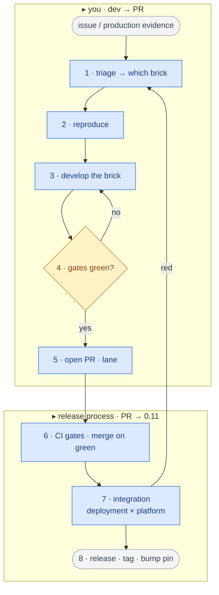

# Contributing to Vexa

Vexa is built as **bricks** — independent modules behind versioned contracts.
Contributing means working on **one brick**, proving it in isolation, and letting
machine **gates** earn the trust so review stays light. Below is the canonical
path from a change to a release.

- **The brick map + how to debug each one:** [`modules/README.md`](modules/README.md)
- **The binding spec (contracts · gates · lanes · conventions):** [`MANIFEST.md`](MANIFEST.md)

## The development process: dev → release

**1 · Triage → which brick (or not).** *Most* changes scope to a single brick
(`pkg:<module>`) — match the symptom in the
[*if… → then debug*](modules/README.md#2-if--then-debug) table. But not everything
fits one, and that's information: a symptom spanning several bricks usually means
either **(a) a missing brick** — the concern isn't extracted yet, so the change is
to *extract a new one*, or **(b) a genuine integration / cross-cutting issue**
(lifecycle, auth, orchestration, the wiring itself) — owned at the assembly /
integration layer, not a domain brick. Triage's first job is deciding which of the
three you have.

**2 · Reproduce it — without the full stack.** Pick the surface that fits: the
**product extension** (live; everything downstream of the page), a **`capture.v1`
fixture** (offline; everything downstream of capture), or the **`join` harness** (in
isolation — egress / geo / throttle). Commands + the full runbook are in
[modules/README §3 · How to debug](modules/README.md#3-how-to-debug). No fixture for
your bug yet → [get one](modules/README.md#b--offline--replayable--fixtures-the-output-of-capture).

**3 · Develop the one brick.** Edit only that brick's `src/`. The hot loops keep
you fast (backend `npm run dev`, extension `npm run dev` watch, join `make debug`).

**4 · Prove it — brick gates** (green = trusted, no human re-check):
- `gate:isolation` (`npm run check:isolation`) · `gate:standalone` (`npm run build` / `tsc`) · `gate:drift` (local contract copy == canonical) · `gate:replay` (fixture → golden).
- **Every fix becomes a fixture:** the repro you captured becomes the golden the oracle now enforces — the regression can't come back.

**5 · PR · lane by path** ([MANIFEST §5](MANIFEST.md)):
- `lane:internals` — one brick's `src/`+`fixtures/`+`docs/` → machine gates + rubber stamp, parallel.
- `lane:contract` — touches `contracts/` → the **one** human gate reviews **schema diffs + goldens only**; a contract PR that needs reading internals to evaluate is rejected as under-specified.
- Branches: incubate in **your fork** (`brick/*`, `spike/*`, no promises); ship from upstream (`pack/*`, WIP = 3).

> **Open the PR and you can stop here.** Steps 6–8 are the **release process** —
> they happen *to* your merged PR (CI, maintainers, the release cadence), not work
> you do. Your job was one brick proven by green gates; the rest carries it to 0.11.

---

**6 · CI gates → merge on green.** `.github/workflows/gates.yml` runs every gate;
merge only when green. No green, no merge — that *is* the trust contract.

**7 · Integration build tests** (release candidates). The deployment × platform
matrix — **{Lite, Compose, Helm} × {Google Meet, Zoom, Teams}** — in a throwaway
env: build + bring-up smoke, **fixture-fed E2E** (`capture.v1` → ingest → assert
`transcript.v1` from the API), infra-plane checks (spawn / persist / auth / cleanup),
and a **live join+capture smoke** per platform (the only part fixtures can't cover).
The matrix **scales to what changed** — a release tests the cells the changed
bricks touch; the *full* 9 cells are the **0.11 milestone gate**, not every release.

**8 · Release** ([MANIFEST §6](MANIFEST.md)) — **one or a few bricks at a time**.
A release is a **pin bump** for the changed brick(s) in `release.yaml` (the pin-set),
not a whole-stack cut. Per-brick tag (`<module>-vX.Y.Z`) cut on green gates —
nothing re-verified. Hotfix: fix brick → gates green → bump one pin → redeploy one
assembly (compose/helm) or rebuild the bundle (lite). Target: **hours**.

> **The leverage:** steps 1–4 make each brick *trustworthy in isolation*, so step 7
> only has to test the **wiring**, not each brick's behavior again. Gates are why a
> 9-cell integration matrix is affordable instead of a re-test of everything.

---

## GitHub Issues

We use GitHub Issues as our main feedback channel.

- **New issues are triaged within 72 hours.** Triage means: label + short comment (accepted / needs more info / won't fix).
- Not every feature will be implemented, but every issue will be acknowledged.
- Look for **`good-first-issue`** if you want to contribute.

---

## Contributor License Agreement (CLA)

To ensure that all contributions are legally clean and consistent with the Apache License 2.0
, Vexa requires every contributor (individuals and corporations) to sign a Contributor License Agreement (CLA) before their first contribution is merged.

Individuals: please review and sign the [Individual CLA](CLA/Individual_CLA.md)
.

Corporations: if you are contributing on behalf of your employer, please have an authorized representative review and sign the [Corporate CLA](CLA/Corporate_CLA.md)
.

📌 How to submit your CLA

Download the appropriate CLA (Individual or Corporate).

Fill in the required fields and sign (digital or scanned signature is fine).

Submit the signed CLA by one of the following methods:

Attach it to a GitHub issue or pull request (preferred), or

Email it to: info@vexa.ai

Once your CLA is on file, all future contributions from you (or your authorized employees, in the case of a corporation) will be automatically covered.
