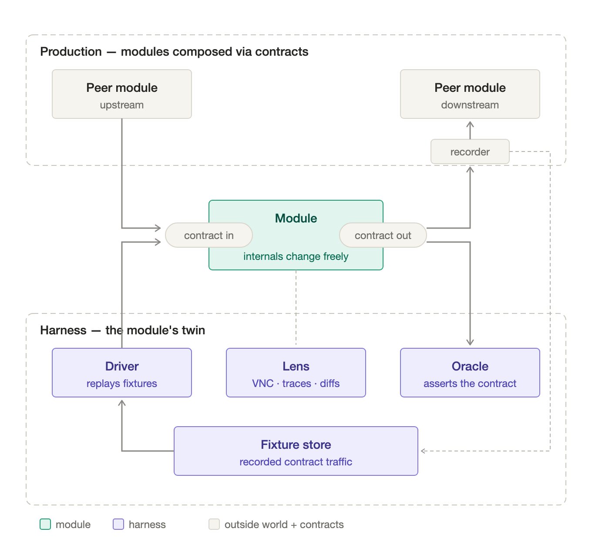
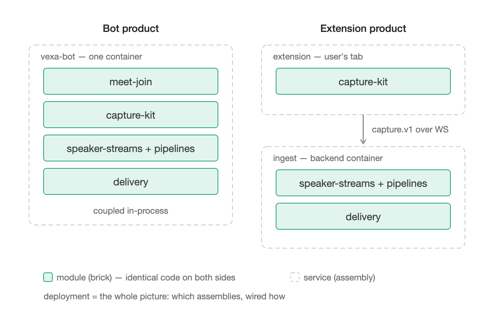
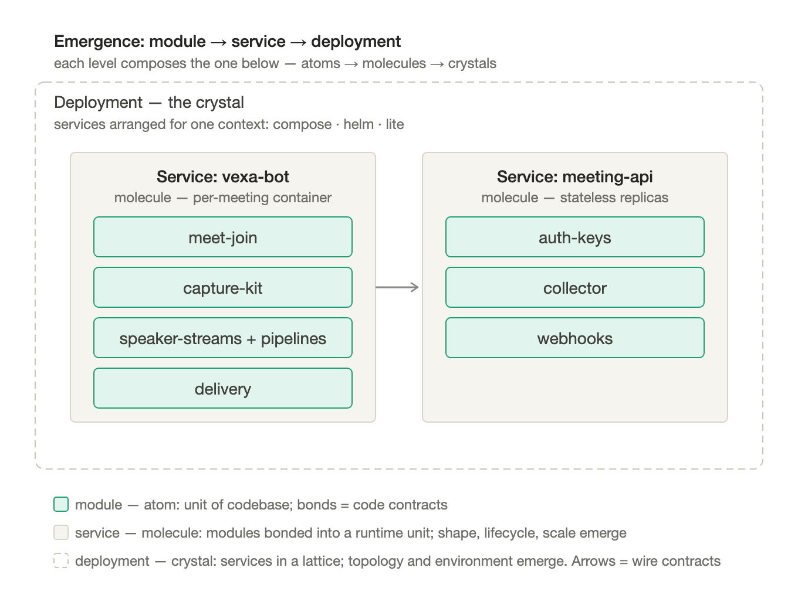
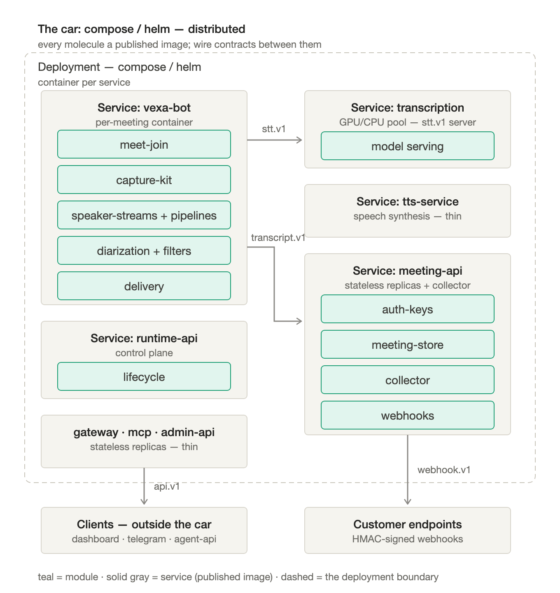
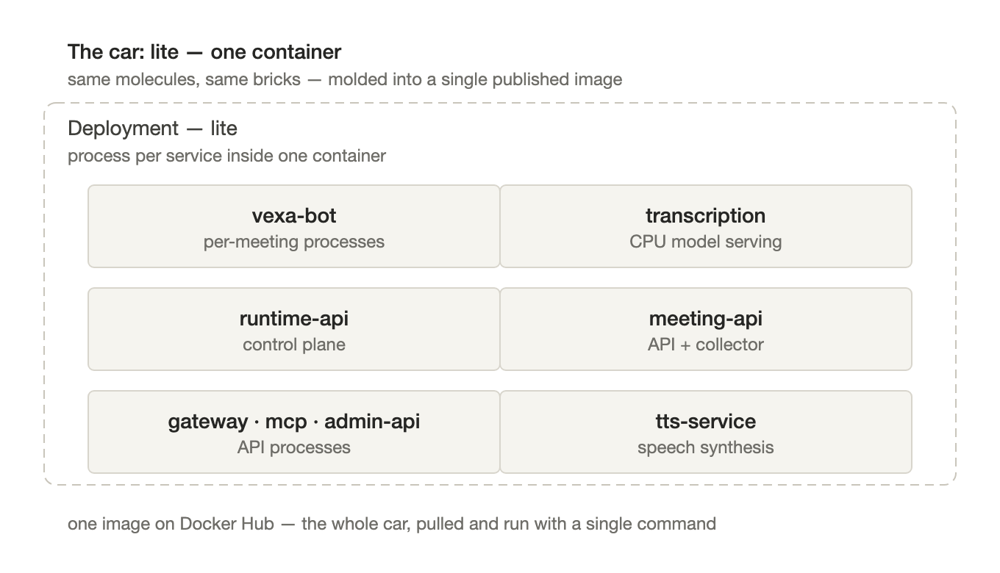
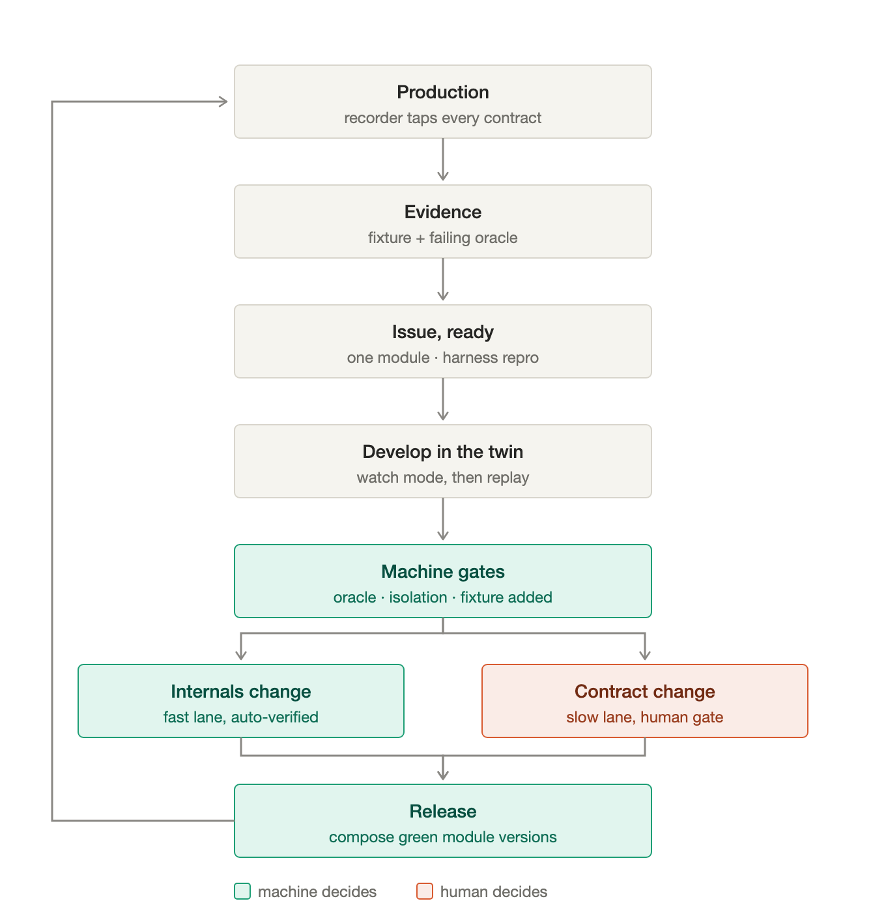
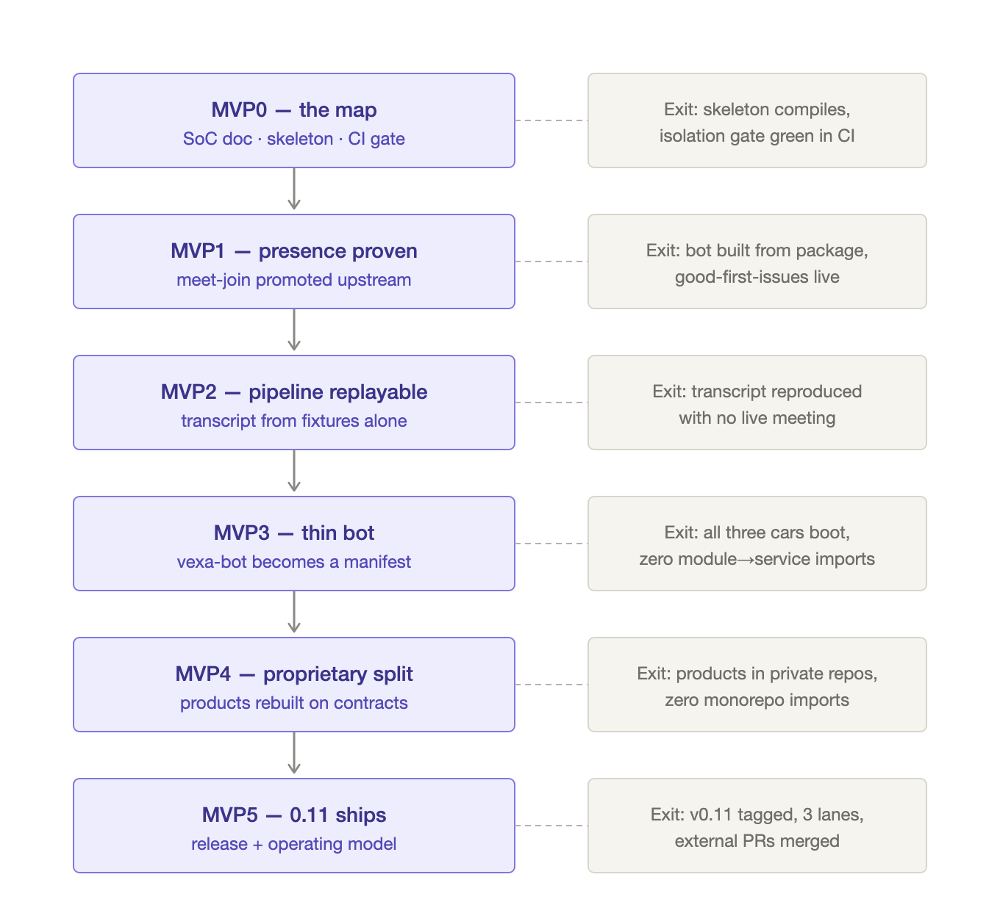

# Vexa 0.11 MANIFEST — operating spec (v2)

> Mechanical counterpart of [MANIFESTO-0.11.md](MANIFESTO-0.11.md). The manifesto argues; this file specifies.
> Status: merged via MVP0 (#442); binding.
> Binding: behavior that diverges from this file is either a bug or a PR against this file — never silent drift.

## 0. Primitives

Ten primitives. Everything else in this file — inventory, gates, process, releases — is these primitives applied. The structure is an **emergence hierarchy: modules compose into services, services compose into deployments** — atoms → molecules → crystals. Each level adds properties the one below doesn't have (service: runtime shape, lifecycle, scale; deployment: topology, environment). Images, tags, and pins are not levels — they are the bonding mechanics between levels. The Lego frame: **module = brick, service = assembly, deployment = the car**; only bricks and studs are permanent, assemblies and cars are configurations.

**P1 — Module (brick).** The unit of codebase, isolated for functional separation of concerns. *Law: code lives only in modules.* Three kinds — **domain** (meeting functionality), **infra** (running the platform), **client** (consuming the platform) — with identical primitives; only the harness flavor differs (§4). A module is defined by its artifacts (contract + harness + gates passing), never by its directory.

**P2 — Contract (stud).** A module's only coupling with the world. *Law: data-shaped, versioned, standard where a standard exists; golden example messages ship with every contract — the examples are the spec.* Two levels: **code contracts** between modules (the `_host.ts` pattern), **wire contracts** between services (§2 registry). A network hop may exist only where a wire contract exists; the reverse is not required.

**P3 — Harness.** The module's twin; it impersonates everything around the module through the same contract ports production uses. Anatomy: **driver** (feeds contract-in), **oracle** (asserts contract-out), **lens** (how to watch: VNC, traces, diffs — serves humans and agents equally). Two modes: **watch** (live, lens open, for exploration/debugging) and **replay** (fixtures in, oracle verdict out, for CI). *Laws: the harness speaks only the contract — if it must reach inside, the boundary is wrong; no harness, no module.*

**P4 — Fixture.** Recorded contract traffic. *Law: telemetry = test data = debug capture — one artifact.* The fixture format is the contract serialization; defining a contract defines its fixtures. Provenance classes: `synthetic`, `internal` (our own meetings), `production` (**forbidden until a redaction pipeline exists**).

**P5 — Recorder.** Taps contracts in running systems and emits fixtures as a side effect of operation. *Law: every wire contract is tappable; recording is configuration, not code change.* Embryo already in tree: `raw-capture.ts` (`RAW_CAPTURE=true` → per-speaker WAVs + timestamped DOM events).

**P6 — Service (assembly).** The unit of runtime: a **manifest** — which bricks, what wiring, which runtime shape (container per meeting, pooled workers, stateless replicas, a browser extension). *Law: a service owns no domain logic; a fat service is bricks fused together, and thinning = un-fusing until only the manifest remains.* The service list is a product snapshot, never architecture: the same bricks assemble into the bot product (one container, in-process) or the extension product (capture in the user's tab + the same pipeline bricks behind `capture.v1` as a backend ingest service).

**P7 — Deployment (car).** A way to run the software: a set of services + topology + config for one context. Services build into **images published on Docker Hub** — one image per service, as today; `lite` is one more published image that packages the whole car. *Laws: deployments pull published images, never build them; image tags are immutable — `promote` re-tags forward (`:dev` → `:latest`), never rebuilds (already the tests3 law). By the time anything reaches a deployment it is verified and immutable.* Today's cars: `deploy/compose` (laptop), `deploy/helm` (cloud), `deploy/lite` (single container), Today this layer is driven by the `tests3` engine — itself a monolith-era artifact (its evidence registry of `proves:`/`symptom:` checks is, in 0.11 terms, hundreds of module oracles written at the only level where verification was possible). As module gates absorb those checks, the deployment layer keeps only the verbs (`build·deploy·promote`) and a thin boot smoke per car.

**P8 — Gate.** A machine verdict on a module's artifacts; green is binding (trust contract, §4). *Law: no human approval is required for correctness — humans judge only what machines cannot.*

**P9 — Lane.** Every change rides one of two: **internals** (inside one module's contract surface — machine-gated, unbounded parallelism) or **contract** (moves a boundary — rare, versioned, through the one human gate, which reviews contract diffs and goldens, never implementations). *Law: lane assignment is a path filter, not a judgment.*

**P10 — Pin-set (release).** A release is a set of brick versions whose contract versions agree (`release.yaml`, evolving today's `VERSION`). *Law: release = composition of already-green versions; nothing is re-verified at release time.*

**How they compose — the loop.** Develop inside a module against its harness (P3) on fixtures (P4); gates (P8) freeze a brick version; a pin-set (P10) selects versions; assemblies (P6) snap bricks into runnables; a deployment (P7) runs them; the recorder (P5) taps the contracts (P2) and yesterday's production becomes tomorrow's fixtures. One direction of derivation, one feedback path. *The isolation law that holds it together: modules never import services; services import modules freely — that is the thinning mechanism, so fat can only shrink.*

## 1. Inventory (grounded in today's tree, branch `0.11-integration`)

### 1a. Domain bricks

| Module | Concern | Lives today | Harness today |
|---|---|---|---|
| `join` | join / admission / leave / removal per platform | `vexa-bot/core/src/platforms/{googlemeet,msteams,zoom}`; extracted as `modules/join` on `pack/meet-join-extraction` | VNC watch — hot debug container only (reproducible) ✅ |
| `capture` | in-page audio + speaker/chat detection → `capture.v1` | `modules/capture` — **browser-pure**; extension imports `@vexa/capture`, bot bundles it | extension is the live testbed ✅ |
| `pipeline` | audio → `separated-transcript.v1` (opaque keys). **Internal strategies:** multistream (gmeet, channel id) ‖ mixed (zoom/msteams, diarizer cluster id), selected by `meta.topology`. Owns VAD + stt-client + hallucination-filter | `modules/pipeline` — **both strategies in-brick**: mixed = `ChunkedTranscriber` + `diarization/` (gate→wespeaker→clustering) + `createMixedPipeline` adapter; multistream = `SpeakerStreamManager`. **Bot imports `@vexa/pipeline`; in-bot copies deleted** | unit + wav + live + offline replay ✅ |
| `speaker-attribution` | `separated-transcript.v1` (opaque keys) + capture.v1 names → `transcript.v1` (named). **Internal strategies:** caption-mapper ‖ diarizer cluster-name-binder | `modules/speaker-attribution` — caption-mapper ‖ `cluster-name-binder` (`attributeMixed`) both in-brick; **`transcript.v1` schema now defined** | unit ✅; fixture replay ✅ (golden diff at MVP2) |
| `recording` | acquire (PulseAudio/MediaRecorder) + deliver (chunked upload) → `recording.v1`. **Internal strategies:** MediaRecorder (gmeet/teams) ‖ PulseAudio (zoom); audio ‖ video | `modules/recording` | replay vs fake receiver |
| `recorder` | contracts → fixtures (P5 tee) | `modules/recorder` (from `raw-capture.ts`) | feeds every other harness |
| `delivery` | `transcript.v1` segment publishing + callbacks | `{segment-publisher,unified-callback}.ts` — **still in bot** | replay FULL mode ✅ |

### 1b. Infra bricks (today fused inside `meeting-api` 17.9k LOC and `runtime-api`)

| Module | Concern | Lives today | Harness flavor |
|---|---|---|---|
| `auth-keys` | API keys, tokens, users | `meeting-api/auth.py`, `admin-api` | recorded request/response |
| `meeting-store` | meeting records, persistence | `meeting-api/{models,database,meetings}.py`, `libs/admin-models` | schema tests + seeded-DB fixtures |
| `collector` | consumes `transcript.v1` → store | `meeting-api/collector/` | replay recorded segments |
| `webhooks` | HMAC-signed delivery + retry | `meeting-api/{callbacks,outbound_events,post_meeting}.py` | golden payloads + fake receiver |
| `meeting-lifecycle` | the meeting state machine: status transitions on events | `meeting-api/{meetings,callbacks,container_stop_outbox}.py` | replay recorded `lifecycle.v1` command/event streams |
| `bot-orchestration` | spawn/stop/exit mechanics, backends (process, k8s) | `runtime-api/` (`lifecycle.py`, scheduler, backends) | fake-orchestrator driver |

### 1c. Client bricks

`transcript-rendering`, `vexa-client`, `vexa-cli` (`packages/`, npm-published) — unit + contract tests against `api.v1` goldens.

### 1d. Assemblies today (product snapshot, not architecture)

| Service | Runtime shape | Assembles | Today → direction |
|---|---|---|---|
| `vexa-bot` | browser container, one per meeting | `@vexa/{join,capture,pipeline,speaker-attribution,recording,recorder}` (+ delivery, still in-bot) | 31k LOC FAT → pure manifest |
| `vexa-extension` | MV3 in the user's browser | capture (+ `ingest-server` runs the same pipeline bricks server-side) | 1.5k ✅ thin |
| `transcription-service` | GPU/CPU model pool | model serving behind `stt.v1` | 2.2k ✅ **the thin exemplar** |
| `meeting-api` | stateless API + collector | auth-keys, meeting-store, collector, webhooks | 17.9k FAT → thins |
| `runtime-api` | control plane | lifecycle | 5.3k, stays thin |
| `api-gateway` · `mcp` · `admin-api` | stateless replicas | client/infra bricks | thin-ish |
| `tts-service` | model server | — | 0.8k ✅ |
| `dashboard` · `telegram-bot` · `calendar-service` · `agent-api` | clients of `api.v1` | client bricks | **out of 0.11 scope** |

### 1e. The cars

The two ways the same molecules run today. Distributed — every service a published image, wire contracts between containers:

And molded — the identical services as processes inside one published image:

The paradigm is already in embryo: recorder = `raw-capture.ts`; replay harness = `production-replay.test.ts` (CORE: no infra / FULL: through Redis; `make play-replay DATASET=teams-3sp-collection`); proto-`capture.v1` = the documented WS frames in `ingest-server.ts`. 0.11 names, formalizes, and gates what the codebase already grew.

## 2. Wire-contract registry

| Contract | Between | Format | Standard? | Status |
|---|---|---|---|---|
| `capture.v1` | bot/extension capture → pipeline bricks (in-process in bot; WS via `ingest-server`) | JSONL events (incl. **`chat`**) + framed audio chunks — **also the fixture format** | custom | schema + codec + validator ✅; goldens ongoing |
| `stt.v1` | stt-client → transcription-service | OpenAI-compatible audio API | standard — never fork it | live since v0.10 |
| `separated-transcript.v1` | `pipeline` (mixed ‖ multistream) → speaker-attribution | speaker-separated segment JSON keyed by an **opaque** channel/cluster id (not a name) | custom | schema ✅ + real-time fixture recorded; goldens at MVP2 |
| `transcript.v1` | speaker-attribution → collector | attributed segment JSON (de facto Redis schema today) | custom | **schema now defined** ✅ + real-time fixture; goldens at MVP2 |
| `api.v1` | api-gateway / mcp / meeting-api → world | OpenAPI + WS + MCP schemas | partial (MCP standard) | version at MVP4 |
| `acts.v1` | meeting-api / runtime-api → vexa-bot | act commands (speak, chat, screen) | custom | define at MVP3 |
| `webhook.v1` | webhooks → customer endpoints | HMAC-SHA256 signed JSON | custom — live since v0.9 | version at MVP4 |
| `lifecycle.v1` | meeting-lifecycle ↔ bot-orchestration | idempotent commands (ensure-running / ensure-stopped) + durable exit events | custom — semantics exist as hand-built outboxes (Pack J, Pack D.2 after #266 orphan pods) | formalize at MVP3 |

Rules: contracts live in `contracts/<name>/v<N>/` (schema + README + goldens); additive = same version, breaking = `v<N+1>`, old kept until unpinned; no shared classes/state/callbacks across a boundary.

**`capture.v1` spelled out** (one format, three jobs — wire format, recorder output, pipeline test input): `events.jsonl` (one timestamped JSON object per line: join/leave, active-speaker, captions, chat, admission state — capture's speaker hints ride here) + `audio/` chunks (PCM or Opus, each with start timestamp, duration, **channel id**); `meta.json` declares topology — `channels: per-participant` (identity free by channel) or `channels: mixed` (diarization required). Replay = both files through contract-in on the original clock. Channel topology selects the strategy: `per-participant` → **multistream-pipeline** (channel-labeler, gmeet); `mixed` → **mixed-pipeline** (diarizer, zoom/msteams). The two are **internal strategies of one `pipeline` brick** — distinct internals (channel labels vs online clustering) with distinct live-platform failure modes — converging on **one** contract-out, `separated-transcript.v1`, asserted by **one** oracle, and that opaque-keyed seam feeds a single downstream **speaker-attribution** brick (name resolution single-sourced; see `contracts/separated-transcript/v1`). Both strategies are now **extracted into `modules/pipeline`** (`ChunkedTranscriber` + `diarization/` for mixed, `SpeakerStreamManager` for multistream; in-bot copies deleted); naming lives in `modules/speaker-attribution`; the recorder writes the `capture.v1` fixture that replays them.

## 3. Skeletons

### 3a. The monorepo — current tree plus a minimal delta

| Path | 0.11 change | Role |
|---|---|---|
| `MANIFEST.md` | **NEW** | this file |
| `contracts/` | **NEW** | all wire boundaries: `capture/v1` `stt/v1` `transcript/v1` `acts/v1` `lifecycle/v1` `api/v1` `webhook/v1` |
| `modules/<module>/` | one per extracted brick | **extracted:** join · capture · pipeline · speaker-attribution · recording · recorder. **next:** delivery, then infra bricks as services thin (MVP3–4) |
| `.github/` | +5 workflow files | the gates (§4) |
| `packages/` | unchanged | npm-published client SDKs only (`transcript-rendering`, `vexa-cli`, `vexa-client`); domain/infra bricks live in `modules/` |
| `services/` | unchanged | assemblies — thinned, never rewritten, never deleted |
| `deploy/` | unchanged | the cars: `compose/`, `helm/`, `lite/` |
| `tests3/` | shrinks | monolith-era artifact — built to validate what couldn't be verified alone. Its evidence checks migrate into module oracles/fixtures as gates absorb them; what stays: `build·deploy·promote` verbs + a thin boot smoke per car |
| `libs/` | unchanged | absorbed brick by brick (`admin-models` → `meeting-store`) |
| everything else | untouched | `docs/`, `scripts/`, `Makefile`, `VERSION`, … |

Thinning rule: functionality moves into `modules/<module>` behind a contract; the service keeps its name, image, and place in deploy, and consumes the module. If a step touches more than one module plus `contracts/`, the step is too big — split it.

### 3b. Every module ships the same nine artifacts

| Artifact | The rule it carries |
|---|---|
| `README.md` | front door: what it does, contract summary, run watch/replay — 5 lines |
| `docs/` | updated in the SAME PR as any behavior change (`gate:docs`) |
| `contract/` | re-exports from `/contracts` — the only public surface |
| `src/` | internals; free to change, invisible outside |
| `harness/driver/` | feeds fixtures or synthetic input through contract-in |
| `harness/oracle/` | asserts contract-out: golden diff, schema check, invariants |
| `harness/lens.md` | how to watch: VNC port / trace endpoint / diff command |
| `fixtures/` | index; small inline, large by content hash → store (MinIO `vexa-fixtures`) |
| `check-isolation` + `Makefile` + `Dockerfile` + lockfile | isolation fails on any boundary escape; targets `watch · replay · record · gates`; standalone build |

## 4. Gates and the trust contract

| Gate | Fails when |
|---|---|
| `gate:isolation` | any import escapes `contract/`, or a module imports from `services/`, `libs/`, or another module's `src/` |
| `gate:standalone` | the module needs anything outside itself to build |
| `gate:oracle` | `make replay` — oracle rejects contract-out on any fixture |
| `gate:fixture` | a `fix:` PR adds no fixture reproducing the bug |
| `gate:docs` | `src/` or `contract/` changed but docs did not (escape: `docs:unaffected` + one line) |

**What makes green binding** — green means *no recorded behavior regressed, no boundary violated, evidence attached* (never "no bug exists"):

1. **Determinism:** in CI replay, `stt.v1` (and TTS) responses are part of the fixture — replay is bit-deterministic, oracles exact-match. Model *quality* (WER, attribution on the quality datasets) is a separate scheduled, non-blocking trend job. Correctness blocks; quality never does.
2. **Hermetic:** no network except content-addressed fixture fetch; lockfiles, base images, fixture hashes pinned.
3. **The ratchet:** every production bug adds its fixture; a bug class can return exactly once in history.
4. **Live-platform bricks pass at the release boundary:** per-PR CI cannot join meetings; `join`/`capture` merge on the four deterministic gates, and the live canary (solo meeting, oracle on `capture.v1` out) gates cutting the version. The pass sits where it can be real.
5. **Zero tolerated flake:** a flaky fixture is quarantined by PR with an issue the same day — never retried-until-green.

Harness flavor by kind: domain replays `capture.v1` + recorded `stt.v1`; infra replays recorded request/response, seeded-DB fixtures, golden webhook payloads; client runs contract tests against `api.v1` goldens.

## 5. Process

**Issue ready** = scoped to one module (`pkg:<module>`) + a repro that runs in its harness (failing fixture, or watch script for live-platform bricks). **Done** = oracle green, isolation green, fixture added, docs updated. Bug = fixture the oracle rejects; feature = proposed oracle assertion + contract impact (none / additive / breaking). `good-first-issue` requires: failing fixture id + exact command + expected oracle output.

**Lanes** (path-filter assigned): internals — one module's `src/`+`fixtures/`+`docs/`; machine gates + rubber stamp; unbounded parallelism. Contract — touches `contracts/` or this file; the one human gate reviews schema diffs and goldens only; a contract PR that requires reading internals to evaluate is rejected as under-specified.

**Conventions registry** — every name pattern in the process; if a convention isn't here, it doesn't exist:

| Pattern | Meaning |
|---|---|
| `brick/<concern>` | incubation branch (any fork): carves one concern toward brickhood — a future module or contract. No gates, no promises. Renamed to `pack/*` at promotion |
| `spike/<topic>` | incubation branch (any fork): throwaway experiment. Never promoted — its learnings become issues |
| `pack/<topic>` | shipping branch: an issue pack driven to merge upstream, counted by the WIP gate |
| `[Pack] <title>` + label `pack` | a pack issue — the unit of WIP; exactly these are counted against WIP = 3 |
| `pkg:<module>` | issue/PR touches this brick |
| `lane:contract` / `lane:internals` | auto-applied by path filter (§5 lanes) |
| `status:available` / `status:in-progress` | pack state; flipping to in-progress claims a WIP lane |
| **Pause protocol** | in-progress → available + a state-snapshot comment on the issue: what's done, what's next, where the branch lives. Resume = flip the label back |
| `good-first-issue` | only with: failing fixture id + exact command + expected oracle output |
| `docs:unaffected` | escape for `gate:docs`, requires one-line justification |
| `fix:` / `feat:` commit & PR prefixes | conventional commits; `gate:fixture` triggers on `fix:` |
| `Closes #<pack-issue>` in PR body | every pack PR links its pack issue; merge closes it |
| `<module>-vX.Y.Z` | brick version tag (§6) |
| `<contract>/v<N>` | contract version directory (§2); `<contract>/<fixture-id>` names fixtures (§4) |
| milestone `0.11` | all MVP packs carry it |

**Branches:** incubation in **your fork** — any contributor's, maintainer's included, same rules (`brick/*`, `spike/*`, unbounded, no promises). Shipping from upstream `Vexa-ai/vexa` (`pack/*`, **WIP = 3**, `dev-init/scripts/wip-gate.sh`; visibility via `master/scripts/standup.sh`). Promotion gate, all green: isolation, standalone, harness runs (replay ≥1 fixture, or watch vs solo meeting for live-platform bricks).

## 6. Releases

Per-brick tags (`meet-join-v1.2.0`) cut on green gates, nothing re-verified. `release.yaml` = the pin-set; releasing = bumping pins. Hotfix: fix brick → gates green → tag → bump one pin → redeploy one assembly (compose/helm) or rebuild the bundle (lite). Target wall-clock: hours.

## 7. Roadmap — MVP exit gates

**The trim ratchet.** Every MVP exits only when its trim list is empty. Extraction without deletion at source is duplication, not modularization; stale = superseded by something this MVP shipped. Trims are ordinary `lane:internals` PRs riding the same pack.

- [ ] **MVP0 — the map.** This MANIFEST + `contracts/` + `modules/` skeleton merged upstream; `gate:isolation` runs on PRs; milestone + labels exist.
  *Trim:* superseded architecture docs (`docs/architecture-proposed.md`, `docs/architecture-refactoring-plan.md`) archived in favor of the MANIFEST; Mintlify deploy branch repointed `pre-commit/v0.9` → `main` and the stale branch deleted. **Bootstrap rule:** MVP0 is the first change to ride the process it defines — filed as a ready issue (oracle: the gate job runs green), branched as `pack/*` under the WIP gate, laned `lane:contract` by its own path filter, reviewed at the human gate as schemas + goldens only. `stt.v1` ships with a real recorded golden, not a stub.
- [ ] **MVP1 — presence proven.** `meet-join` promoted upstream; the bot assembly imports the brick (arrow points service → module, never back); `make watch` joins a live meeting; ≥5 qualifying `good-first-issue`s.
  *Trim:* the in-bot join code (`platforms/{googlemeet,msteams,zoom}` join/admission paths) deleted at source — the move completes only on deletion; join-era fork branches (`stitch/gmeet-join-restore`, `pack/407*`, `release/meet-join-fix*`) closed and deleted.
- [ ] **MVP2 — pipeline replayable.** `capture.v1` + `transcript.v1` formalized from the embryos (`ingest-server` frames, `raw-capture` dumps); pipeline bricks extracted with `production-replay` promoted to their `make replay` gate — attributed transcript reproduced in CI: no bot, no meeting, no GPU.
  *Progress (this session):* `pipeline` mixed strategy (gate→diarizer→Whisper) and `speaker-attribution` cluster-name-binder **extracted into bricks**; `separated-transcript.v1` + `transcript.v1` **schemas defined**; `capture.v1` gained a `chat` event + a faithful timestamped fixture form (`stream.capture`); full chain proven **live** (product extension → modules → sidepanel) **and offline** (fixture replay, ~98% match). **Done of the trim:** in-bot copies of `chunked-transcriber`/`diarization`/`cluster-name-binder` deleted; bot imports `@vexa/pipeline`. *Remaining:* formalize `capture.v1`/`transcript.v1` + record goldens; promote `make replay` to a **CI gate**; consolidate `cluster-name-binder` to one brick; `raw-capture.ts` retire; tests3 migration.
  *Trim:* `raw-capture.ts` and the in-bot copies of extracted pipeline code deleted at source; bot/extension transcription-core duplication ends (single-sourced bricks only); tests3 registry checks covering pipeline behavior migrate into brick oracles and are deleted from `registry.yaml`.
- [ ] **MVP3 — thin bot.** `acts.v1` and `lifecycle.v1` defined (the latter formalizing the Pack J / Pack D.2 outbox semantics); `vexa-bot` thinned to a manifest; `runtime-api` stays thin; zero module→service imports repo-wide; all three cars boot.
  *Trim:* `vexa-bot/core/src/services/` (the name-colliding folder) emptied and removed; hand-rolled outbox/callback reliability code retired where `lifecycle.v1` semantics replace it; tests3 lifecycle/bot checks migrated and deleted.
- [ ] **MVP4 — proprietary split.** `api.v1` + `webhook.v1` versioned and published; `meeting-api` thinned (infra bricks extracted); proprietary products build in private repos against published contracts with zero monorepo imports — we are the contracts' first hostile customer.
  *Trim:* extracted infra code deleted from `meeting-api` at source; `libs/admin-models` absorbed into `meeting-store` and removed from `libs/`; any proprietary remnants deleted from the monorepo.
- [ ] **MVP5 — 0.11 ships.** v0.11 tagged from a pin-set; one solo brick hotfix shipped through the flow; WIP gate in CI; first external PR merged through machine gates alone.
  *Trim:* tests3 reduced to verbs + boot smoke (migrated checks gone from `registry.yaml`); `VERSION` retired in favor of `release.yaml`; the fork branch swamp (70+ pre-0.11 branches) archived or deleted — incubation starts clean; dead `release/*` and `codex/*` lines pruned.

## 8. Open decisions (resolve by end of MVP2)

1. Raw-audio durable persistence owner — proposal: a storage contract owned by pipeline bricks; implementations pluggable.
2. Fixture redaction pipeline for `production`-class fixtures — until then, `internal` recordings only.
3. Contract artifact publishing channel for MVP4 (npm scope vs git tags vs both).

---

Figure sources are regenerable: `docs/0.11/src/gen_svgs.py` → SVG → PNG (Chrome headless).
