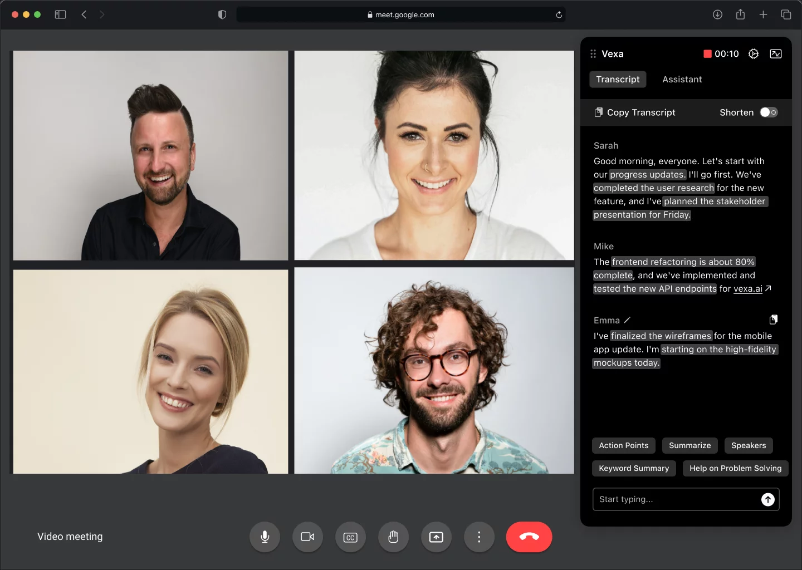
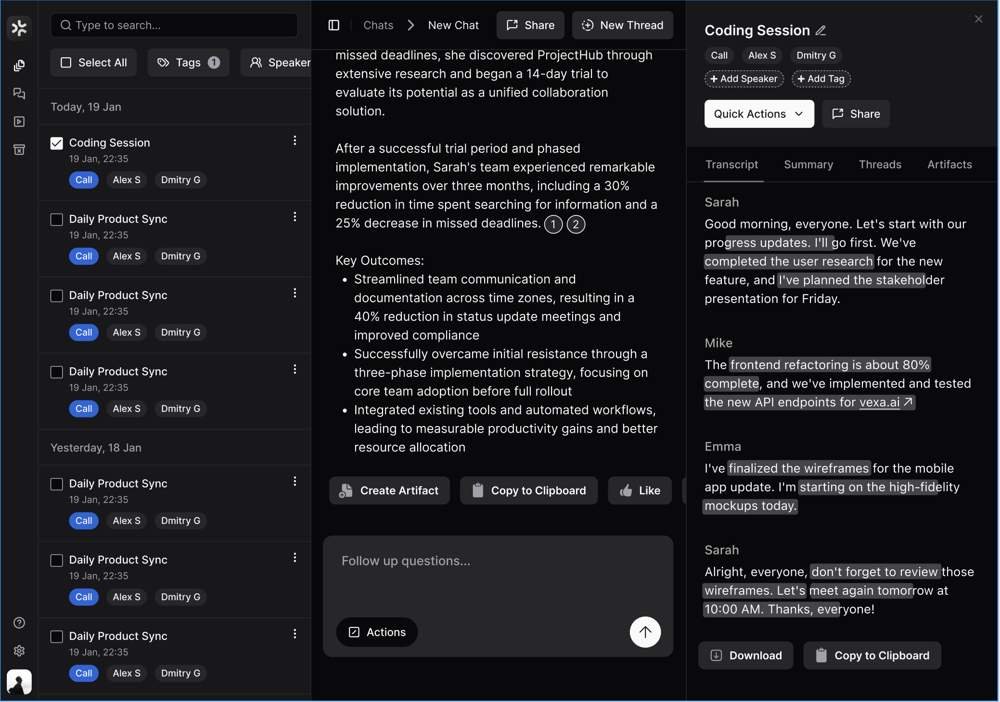

# Vexa - AI Meeting Notetaker and Knowledge Chat for Professionals and Teams

Extract  business knowledge from 
**Google Meet | Microsoft Teams | Zoom | Discord | Slack |** and more

NOTE: The service is live and running, currently being prepared for open sourcing. Planned public release - Late February 2025.

👉 Try it for free at [vexa.ai](https://vexa.ai)

  

Vexa combines the best of AI meeting notetakers (like **Otter.ai**, **Fathom.fm**, **Fireflies.ai**, **Tactiq.io**) with **powerful knowledge management** and **AI chat capabilities**. While other notetakers focus primarily on transcription and follow-ups, Vexa transforms your meetings into an **intelligent knowledge base** - imagine having **Claude Projects**' capabilities but trained specifically on your company's meeting knowledge, with **enterprise-grade security** and **access controls**.

Our distributed system provides:
- **Real-time transcription** with speaker detection
- **Instant knowledge extraction** from conversations
- **Contextual AI chat** that understands your company's entire meeting history
- **Enterprise security** with granular access management

## 🚀 Features

### During meetings:
Real-time speaker-aware meeting transcription with AI contextual support and chat

  
   
  <em>Chrome Extension: Real-time transcription and AI assistance during meetings</em>

### After meetings:
- Meeting knowledge extraction from conversations and documents 
- RAG-powered chat with full company context awareness
- Fine-grained data access control

  
   
  <em>Dashboard: Knowledge exploration and team collaboration</em>

## 🏗 System Architecture

Built on scalable microservices architecture:

### User Interfaces

#### Google Chrome Extension
- Real-time transcripts with enhanced readability
- Interactive contextual support with single-click actions
- Contextual chat with access to company-wide knowledge base

#### Meeting and Chat Interface
- Company-wide data exploration by:
  - Speaker
  - Project
  - Meeting
- Advanced entity search:
  - People
  - Companies
  - Products
  - More

### Backend Architecture

#### 1. Streamqueue Service
- Real-time audio stream collection from client browser

#### 2. Audio Service
- Speech-to-text conversion using Whisper
- Load balancer for distributed model instances (coming soon)
- Speaker-aware transcription processing

#### 3. Engine Service
- Core business logic
- Knowledge extraction and accessibility

## 🛠 Technology Stack

- **Frontend**: React, Chrome Extension APIs
- **Backend**: Python 3.12+
- **Data Layer**: Redis, PostgreSQL, Qdrant, Elasticsearch
- **Infrastructure**: Docker, Docker Compose
- **AI**: local Whisper, Openrouter for LLM calls

## 🔗 Quick Links

- Product: [vexa.ai](https://vexa.ai)
- LinkedIn: [@vexa.ai](https://www.linkedin.com/company/vexa-ai/)
- X: [@grankin_d](https://x.com/grankin_d)
- Discord: [vexa discord server invite link](https://discord.gg/X8fU4Q2x)

---

⭐ Star this repository to get notified when it becomes public!