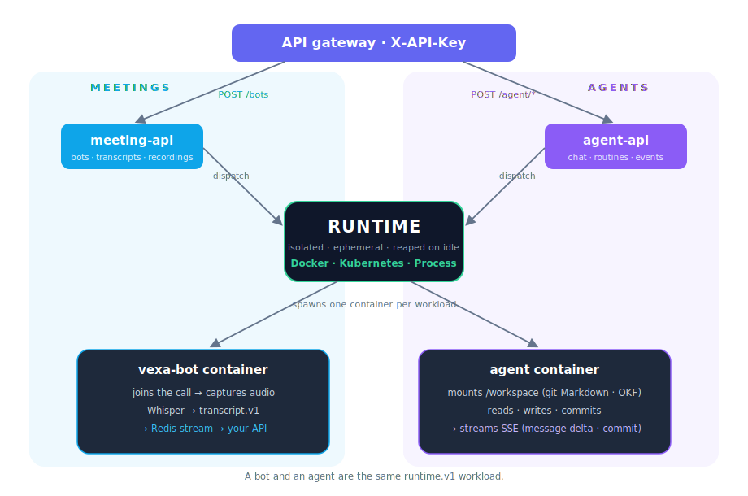

<div align="center">

# Vexa

**Open-source, self-hosted meeting bot & transcription API.**

A bot joins your Google Meet, Microsoft Teams, and Zoom calls and streams speaker-attributed
transcripts in real time through an API *you* host — then feeds sandboxed agents that build a
Markdown knowledge base your team owns. Self-hosted, Apache-2.0, air-gap-ready.

[](LICENSE)
[](#-status--roadmap)
[](#-quickstart)
[](https://discord.gg/vexa)

**▶ Explore the live demo at [core.vexa.ai](https://core.vexa.ai)** — the Terminal workbench running
the full stack, no install.

</div>

---

## Why Vexa

Every meeting-AI tool you can buy — the hosted transcription APIs, the SaaS notetakers — sends
your conversations to *their* cloud and rents you access back. Vexa inverts that: you run the
whole stack yourself, point it at your own models, and own the transcripts and the knowledge
they become.

Three things make that possible — and no one else has all three:

1. **Vexa is _in_ the meeting.** A real bot joins the call and transcribes live across Meet, Teams,
   and Zoom. A reliable, scalable server-side bot fleet with streaming speech-to-text and speaker
   attribution is the genuinely hard part — and it sits *upstream* of where "chat with your docs"
   and "second brain" tools even start. They begin after a transcript exists; **Vexa produces it.**

2. **Your knowledge is files you own.** Transcripts and derived knowledge are written as **Markdown
   in a git repo** (an Open Knowledge Format bundle) — not rows in an app-owned database. Portable,
   diffable, greppable, yours. **Knowledge as code.**

3. **Agents work it, safely.** Sandboxed CLI coding agents (Claude Code, Codex, …) read and write
   that workspace like a developer works a repo — in isolated, ephemeral containers spawned by an
   **orchestration-agnostic runtime (Docker or Kubernetes)**, with no egress except through brokered
   tools. Thousands in parallel, air-gapped, on hardware you control.

---

## Table of contents

- [Quickstart](#-quickstart)
- [How it works](#-how-it-works)
- [The agentic runtime](#-the-agentic-runtime)
- [Agents & your workspace](#-agents--your-workspace)
- [How-to recipes](#-how-to-recipes)
- [Deploy & configure](#-deploy--configure)
- [How Vexa is different](#-how-vexa-is-different)
- [For regulated enterprises](#-for-regulated-enterprises)
- [API reference](#-api-reference)
- [Status & roadmap](#-status--roadmap)
- [Community & contributing](#-community--contributing)
- [License](#-license)

---

## ⚡ Quickstart

Self-host the whole stack on one Linux host, then explore it in the Terminal or drive it over the API.

**Prerequisites** — Docker, and transcription: a free token at [vexa.ai/account](https://vexa.ai/account),
or self-host the (GPU) transcription unit for a fully air-gapped setup. Without transcription, bots still
join and record — they just produce no text.

```bash
git clone https://github.com/Vexa-ai/vexa-core.git && cd vexa-core
make all      # full Docker Compose stack — seeds .env, builds, prints your API key + URLs
make bot      # build the meeting bot from source (required before a bot can join)
```

When `make all` finishes it prints your key and URLs:

```text
  Terminal UI : http://localhost:13000     # the web workbench
  API gateway : http://localhost:18056     # the API
  API key     : vxa_…
```

### Explore in the Terminal (the fast path)

**The Terminal is the way to see what Vexa can do.** Open **`http://localhost:13000`** (or the hosted
[core.vexa.ai](https://core.vexa.ai)) — you're already signed in to a self-host account. From the
workbench you can, with no curl:

- **Send a bot** — paste a Meet / Zoom / Teams URL; a bot joins as a participant.
- **Watch the transcript** stream in live, speaker-attributed, draft-then-confirmed.
- **Chat with your workspace** — ask an agent that has every captured meeting as context, and watch it
  commit what you decide.

### Or drive it over the API

```bash
export API_KEY=vxa_...
export API_BASE=http://localhost:18056

# WIN 1 — send a bot into a live call, then read the transcript as it streams
curl -X POST "$API_BASE/bots" \
  -H "X-API-Key: $API_KEY" -H "Content-Type: application/json" \
  -d '{"platform":"google_meet","native_meeting_id":"abc-defg-hij","bot_name":"Vexa"}'

curl -H "X-API-Key: $API_KEY" "$API_BASE/transcripts/google_meet/abc-defg-hij"

# WIN 2 — ask an agent that has your whole workspace as context (answer streams back as SSE)
curl -N -X POST "$API_BASE/agent/chat" \
  -H "X-API-Key: $API_KEY" -H "Content-Type: application/json" \
  -d '{"prompt":"What did we decide in my last meeting?"}'
```

`platform` is `google_meet` · `teams` · `zoom`; `native_meeting_id` is the code from the join URL. The
agent reply streams as Server-Sent Events — `message-delta` frames carry the text, `commit` frames mark
anything it recorded into your workspace.

---

## 🧩 How it works

One gateway, two domains — **Meetings** (capture) and **Agents** (work the knowledge) — both running on
the same **runtime**: the engine that spawns every bot and every agent in its own sandboxed container.

<div align="center">
  
</div>

A bot and an agent are the **same `runtime.v1` workload** — isolated, ephemeral, reaped on idle — so the
machinery already proven by thousands of meeting bots is exactly what runs your agents. Every arrow stays
inside your network.

---

## ⚙️ The agentic runtime

A CLI coding agent is just a process on Linux. The **runtime** is what turns that into a **multi-tenant,
sandboxed, orchestration-agnostic** execution layer safe to point at real business data — and it's the
same engine already proven in production spawning Vexa's meeting bots.

- **Isolated & sandboxed.** Every dispatch runs in its own container — **no egress except through brokered
  tools**, scoped to only the workspaces and tools it was granted. Isolation is what makes governance real
  rather than advisory, which is why **agents never run in the control plane**.
- **Ephemeral & cheap.** TTL-on-idle: a container lives while it works and is reaped when idle; continuity
  is a session file in the workspace, so nothing stays warm. Sub-second to start, **thousands in parallel**.
- **Orchestration-agnostic.** The kernel owns one `runtime.v1` lifecycle (`starting → running → stopping →
  stopped → destroyed`) and delegates the one substrate question — *how do I start, observe, and stop a
  workload?* — to a pluggable backend. The **same dispatch runs identically** across:

| Backend (`RUNTIME_BACKEND`) | A workload is… | State |
|---|---|---|
| **`docker`** (default) | its own container via the Docker socket — brought up with `make all` | ✅ Shipped (open core) |
| **`process`** | a child process, no Docker socket required | ✅ Available |
| **`k8s`** | a bare **Pod** (`kubectl run --restart=Never`), scheduled across a cluster | 🟡 Lifecycle implemented; workspace-mount + Helm chart landing |

Same control plane, same `unit.v1` dispatch, same worker — only *how* the container is created changes.
That's what lets Vexa scale from one laptop to a Kubernetes/OpenShift cluster **inside your walls**,
without your data ever leaving them.

---

## 🧠 Agents & your workspace

Capture is the front door; **agents** are what make the knowledge compound. Every captured meeting compiles
into your **workspace** — a git repo of Markdown (an [Open Knowledge Format](https://github.com/GoogleCloudPlatform/knowledge-catalog/tree/main/okf)
`kg/` bundle), not rows in an app-owned database. An agent reads and writes it *like a developer works a
codebase* — the same CLI-coding-agent loop (Claude Code, Codex, …), pointed at your knowledge instead of
your source. **Knowledge as code.**

> You've seen the Claude + Obsidian second-brain posts everyone's sharing — Vexa is that, for your team's
> meetings, on your own servers.

**A standalone domain — with or without meetings.** Agents work *any* workspace; a meeting is just one
trigger. The four triggers: **chat** (ask now), **schedule** (a cron routine), **event** (e.g. an incoming
email), and a **finished meeting**.

- **Multiplayer, not single-user.** Team-shared, attributed workspaces — not one person's private notes.
- **Automated, not manual.** The bot captures the call and the transcript compiles itself in — nothing to paste.
- **Safe by design.** Agents are untrusted (prompt-injectable) and enforce nothing themselves. **Trusted**
  input — *you*, in chat — writes to the workspace directly (git is the undo). **Untrusted** input — an
  email, a web page — runs **propose-only**: the agent suggests actions as cards, a human approves, and only
  then does trusted code apply them. Irreversible effects (send, order) are always gated.

> **Status (honest):** meeting capture, transcription, and speaker attribution are **production**. The
> agent dispatch core — an agent in an isolated container over your workspace, streaming its output, with
> durable chat memory — is **built and proven live** (verified end-to-end on Docker and in the Terminal).
> The bucket-backed workspace store, live-meeting copilot, scheduled auto-join, and the Kubernetes
> workspace-mount are **on the 0.12 roadmap** — see [Status](#-status--roadmap).

---

## 📖 How-to recipes

Each is a complete path to one outcome over the [Agent API](#-api-reference). Full guides at
[docs.vexa.ai](https://docs.vexa.ai).

**💬 Chat with your workspace** — ask an agent that has every meeting, email, and note as context; trusted
chat can also record a decision (a git commit).

```bash
curl -N -X POST "$API_BASE/agent/chat" -H "X-API-Key: $API_KEY" -H "Content-Type: application/json" \
  -d '{"prompt":"Brief me on the Acme account: every meeting, the open decisions, and the next step."}'
```

**🌅 Brief me every morning** — an unattended agent on a cron schedule that commits to your workspace.

```bash
curl -X POST "$API_BASE/agent/routines" -H "X-API-Key: $API_KEY" -H "Content-Type: application/json" \
  -d '{"name":"Morning brief","cron":"0 8 * * 1-5",
       "prompt":"Brief me from overnight activity — new meetings, decisions, follow-ups due. Write brief/today.md.",
       "run_now":true}'
```

**📝 Report after every meeting** — dispatch a one-shot agent when a call ends (or a routine that sweeps
recent meetings).

```bash
curl -X POST "$API_BASE/agent/invocations" -H "X-API-Key: $API_KEY" -H "Content-Type: application/json" \
  -d '{"runner":"claude-code","workspaces":[{"id":"u_jane","mode":"rw"}],"trigger":"scheduled",
       "start":{"entrypoint":{"inline":"Write a report for the meeting that just ended: summary, decisions, action items with owners."}}}'
```

**📧 Triage incoming email (safely)** — an event-triggered agent that gets the mailbox **read-only** and can
only *propose* actions as cards; a human approves before anything is written or sent.

```bash
curl -X POST "$API_BASE/agent/events" -H "X-API-Key: $API_KEY" -H "Content-Type: application/json" \
  -d '{"name":"email.received","source":{"uri":"mailbox://u_jane/INBOX/AB12CD"},
       "plan":{"prompt":"Triage this email into tasks; propose a record for each action item and a draft reply."}}'
```

> **Live-meeting copilot** — cards for people, decisions, and action items *during* the call
> (`POST /agent/meeting/start` → stream `GET /agent/meeting/stream`) — is on the roadmap; see
> [Status](#-status--roadmap).

---

## 🏠 Deploy & configure

`make all` brings up the full stack via Docker Compose on one Linux host — each service in its own
container, bound to loopback:

| Service | Role |
|---|---|
| **gateway** `:18056` | the one front door — auth, scopes, routing |
| **terminal** `:13000` | the web workbench (proxies `/ws` → gateway) |
| **meeting-api** | bots, transcripts, recordings |
| **agent-api** | the agent control plane — dispatch, chat, routines, events |
| **runtime** | spawns bot + agent containers on demand |
| **admin-api** · redis · postgres · **minio** | keys · bus + scheduler · metadata · object storage (recordings + workspaces) |

- **Runtime backend** — `RUNTIME_BACKEND=docker` (default) or `k8s` (a Pod per dispatch).
- **Transcription is a separate GPU unit** — `make all` runs **GPU-free**; stand up the STT service
  (faster-whisper, OpenAI-compatible) from `deploy/transcription` on any GPU box and point `.env` at it.
  Or use a free hosted token at [vexa.ai/account](https://vexa.ai/account) while testing.
- **Bring your own inference** — point the agent at your own LLM endpoint; no inference leaves the network.
- **Air-gapped** — everything in-VPC, **zero egress** — the posture the regulated verticals require.
- **Targets** — `make all` · `make bot` (build the bot image from source — required, not pulled) ·
  `make lite` · `make up` / `make down` · `make help`. Expose the Terminal via a TLS reverse proxy for
  production; full guide in the [docs](https://docs.vexa.ai).

---

## 🆚 How Vexa is different

The crowded "AI second brain / self-hosted knowledge base" space is full of excellent tools for
reasoning over documents you *already have*. None of them join a live meeting — they consume
transcripts other tools produced. That's the whole point: **capture is the moat, and it sits
upstream of where a document-RAG tool's architecture even starts.**

Against the tools developers actually weigh for meeting capture:

| Capability | **Vexa** | Hosted APIs (e.g. Recall.ai) | DIY (Whisper + your own bot) |
|---|:---:|:---:|:---:|
| Self-hosted / own your data | ✅ | ❌ their cloud | ✅ |
| Real-time transcript API | ✅ | ✅ | 🟡 build it |
| Joins **Meet + Teams + Zoom** | ✅ | 🟡 varies | ❌ enormous effort |
| Speaker attribution | ✅ | ✅ | 🟡 build it |
| Knowledge as files you own | ✅ | ❌ | 🟡 build it |
| Agents over your workspace | ✅ | ❌ | ❌ |
| Open source | ✅ Apache-2.0 | ❌ | ✅ |

Vexa is the one combination the others don't offer: a **permissively-licensed (Apache-2.0)
meeting-bot-API server** that is **self-hosted × real-time × multi-platform × knowledge-you-own.**
And it's *complementary* to the document-RAG and "second brain" tools — feed them Vexa's clean,
attributed transcripts and let them do what they're good at.

---

## 🏦 For regulated enterprises

For banks, healthcare, government, and anyone in a regulated industry, the meeting-AI question
isn't "which cloud" — it's "how do we get this **without** a cloud." Vexa is **air-gapped meeting
intelligence** — the sovereign alternative to Microsoft Copilot — built for exactly that buyer.

You don't compete with a notes app here — you replace **Microsoft 365 Copilot** and **Zoom AI
Companion** on the axes they structurally can't move:

| | **Microsoft 365 Copilot / Zoom AI Companion** | **Vexa** |
|---|---|---|
| Deployment | Vendor cloud only | Your cloud, your VPC, or **fully air-gapped** |
| Models | Vendor-hosted, fixed | **Bring your own** — local or hosted LLMs |
| Commercial model | Rented, per-seat subscription | **Owned** — Apache-2.0, no per-seat tax |
| Adaptable | Generic; no custom vocabulary; vendor roadmap queue | **Your engineers extend it directly** — domain vocabulary, underserved languages, custom workflows |
| Meeting platforms | Teams-only / Zoom-only | **Meet + Teams + Zoom** |
| Data control | Transits the vendor's cloud | **Never leaves your perimeter** |
| Extensibility | Closed black box | Open source, API-first |

**The things enterprises actually ask for:**

- **Air-gapped** — the only fit for regulated data. Runs fully offline on your own infrastructure and your
  own models. Nothing phones home.
- **Adaptive** — your engineers implement requirements directly, on your timeline. Microsoft Copilot won't
  fine-tune a Croatian language model or your domain vocabulary for you; an open-source stack lets your team
  do exactly that. No vendor feature queue.
- **Owned, not rented** — an investment, not a subscription. Deploy once, own it forever, extend it without
  asking permission. No per-seat tax, no lock-in.
- **Scales like cloud, inside your walls** — the [runtime](#-the-agentic-runtime) spawns every agent in an
  isolated, ephemeral container with no egress; thousands in parallel on Docker or your **Kubernetes /
  OpenShift** cluster, air-gapped, across an org of thousands.

**Built to pass procurement.** This repo ships architecture-as-code
([`architecture.calm.json`](architecture.calm.json), the FINOS **CALM** standard), a published
[`SECURITY.md`](SECURITY.md), [`security-insights.yml`](security-insights.yml), and an explicit
[`license-exceptions.json`](license-exceptions.json) — the artifacts a regulated buyer's review asks for.

> Regulated banks and Fortune-500s run Vexa fully air-gapped on their own OpenShift and local LLMs today.

---

## 📡 API reference

Two APIs behind the gateway, authenticated with `X-API-Key`. Base URL: `http://localhost:18056`
(self-host) or `https://api.cloud.vexa.ai` (hosted).

**Meetings API** — capture; usable standalone:

| Method | Endpoint | Description |
|---|---|---|
| `POST` | `/bots` | Send a bot into a meeting (`platform`, `native_meeting_id`, `bot_name`, `language`, `task`) |
| `GET` | `/transcripts/{platform}/{native_meeting_id}` | Fetch the real-time transcript (poll while live) |
| `GET` | `/bots/status` | List running bots |
| `DELETE` | `/bots/{platform}/{native_meeting_id}` | Stop / remove the bot |
| `GET` | `/meetings` · `/recordings` | List meetings; list recordings (audio in your own storage) |

**Agent API** — the control plane, under the `/agent/*` prefix (identity is derived from your key, server-side):

| Method | Endpoint | Description |
|---|---|---|
| `POST` | `/agent/chat` | Chat over your workspace — streams SSE (`message-delta`, `tool-call`, `commit`, `done`) |
| `POST` | `/agent/invocations` | Dispatch a one-shot agent (e.g. a post-meeting report) |
| `POST` | `/agent/routines` | Create a scheduled (cron) agent routine |
| `POST` | `/agent/events` | Fire an integration event that dispatches an agent (e.g. email triage) |
| `GET` | `/agent/workspace/tree` · `/agent/workspace/file` | Browse and read your Markdown workspace |

`platform` ∈ `google_meet` · `teams` · `zoom`. Full reference: **[docs.vexa.ai](https://docs.vexa.ai)**.

> **v0.12 note:** live bot-control — `PUT /bots/{…}/config` (change language/task mid-call) and
> `POST /bots/{…}/speak` (TTS into the call) — plus the live-meeting copilot (`/agent/meeting/*`) and
> WebSocket streaming are not yet wired in the open-core stack and return `404` today. Send-a-bot, stop,
> status, transcripts, recordings, agent chat, routines, and events are live.

---

## 🗺️ Status & roadmap

Honest state of the **0.12** line (mirrors the [status page](https://docs.vexa.ai) — never aspirational):

| Capability | State |
|---|---|
| Bot joins **Meet / Teams / Zoom** | ✅ Production |
| Real-time transcription (Whisper) + speaker attribution | ✅ Production |
| Redis transcript streaming | ✅ Production |
| Recordings to your own object storage (MinIO) | ✅ Available |
| **Runtime — Docker backend** (container per workload) | ✅ Production |
| **Agent chat / routines / events over your workspace** | ✅ Built & proven live |
| Workspace — git Markdown / OKF `kg/` bundle | 🟡 core proven; bucket-backed store landing |
| **Runtime — Kubernetes backend** (Pod per dispatch) | 🟡 Lifecycle done; mount + Helm landing |
| Live-meeting copilot (cards as the call runs) | 🔵 Next |
| Scheduled auto-join routines | 🔵 Planned |
| WebSocket transcript multiplex | 🔵 Planned (poll today) |
| At-rest encryption (workspace · transcript · tokens) | 🔵 Planned |
| Mid-call bot config / speak | 🔵 Returns 404 in open-core |

✅ Production · 🟡 In progress · 🔵 Planned

---

## 🤝 Community & contributing

- **Try it hosted** — [core.vexa.ai](https://core.vexa.ai) (the Terminal workbench, full stack, no install)
- **Docs** — [docs.vexa.ai](https://docs.vexa.ai)
- **Discord** — [discord.gg/vexa](https://discord.gg/vexa)
- **Issues & PRs** — welcome. See [`SECURITY.md`](SECURITY.md) to report vulnerabilities.

Vexa is built in the open. If you self-host it, extend it, or run it air-gapped somewhere interesting,
we'd love to hear about it.

---

## 📄 License

[Apache-2.0](LICENSE). Own it, run it, fork it, ship it. It's an investment, not a rental.
