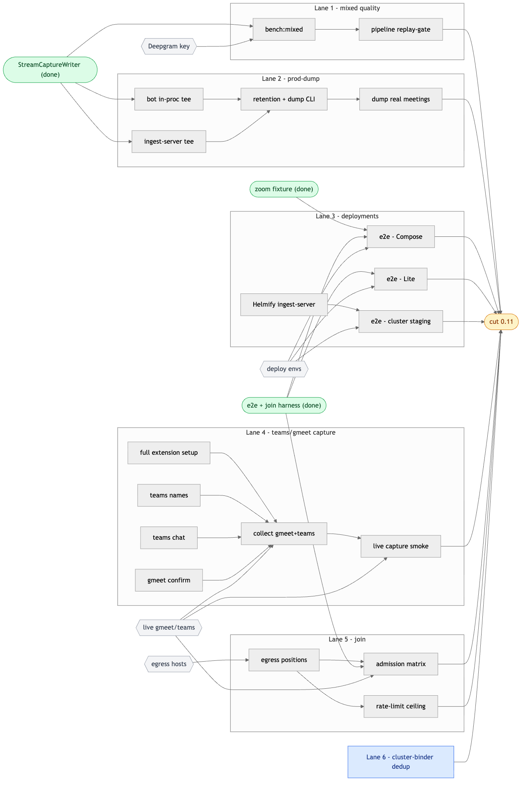

# RELEASE-0.11 — devplan

> The execution plan to ship 0.11 **properly tested**: every brick gated, a fixture
> per platform, the deployment × platform matrix green. Spec: [MANIFEST](MANIFEST.md);
> process: [CONTRIBUTING](CONTRIBUTING.md); debug: [modules/README](modules/README.md).
> Updated **2026-06-14**.

## Release gate (definition of done)

0.11 ships when **all** are true:
- [ ] every extracted brick: gates green in CI — `isolation` · `standalone` · `drift` · **`replay`/golden**
- [ ] **mixed-pipeline benchmark green** — YouTube × Deepgram, **segmentation (primary)** ≥ threshold; transcription WER tracked; cluster count informational
- [ ] **prod fixture-dump wired** (N-day raw `capture.v1` retention + `dump` command) — fixtures come from real traffic
- [ ] fixture corpus complete: `capture.v1` for **gmeet · zoom · teams** (+ separated-transcript.v1 / transcript.v1 goldens), **dumped from prod**
- [ ] integration matrix green: **{Lite, Compose, cluster staging} × {gmeet, zoom, teams}** — fixture-fed E2E + a live join+capture smoke per platform
- [ ] **join validated against real environments** — the prod egress positions × {gmeet, zoom, teams}, admission cross-checked against the host (not the bot's DOM claim), + a rate-limit threshold known per platform
- [ ] feature × platform all ✅ — names, chat, recording each work on each platform

> **Scope decisions (locked 2026-06-14):** `delivery` ships **in-bot** for 0.11 (extract post-release) · all three deployments **block** (Helm validated on a real **cluster staging**, not a throwaway) · **prod fixture-dump is a blocker** (fixtures dumped from prod, not hand-staged).

## Current state (honest, 2026-06-14)

- **Bricks extracted:** join · capture · pipeline · speaker-attribution · recording · recorder ✅ — `delivery` still in-bot.
- **Contracts:** capture.v1 · separated-transcript.v1 · transcript.v1 · recording.v1 · stt.v1 ✅ (real-time fixtures recorded; CI goldens pending).
- **Tooling:** hot dev-stack (`npm run dev`) · fixture recorder (`npm run capture`) · replay (`replay`,`replay:mixed`,`attribute-fixture`) · **fixture-fed E2E harness `npm run e2e` (proven)** · join harness (`make debug`/`debug-cloud`/`debug-rate`).
- **Proven:** **Zoom** end-to-end — live → offline replay (~98%) → fixture-fed API (48 segments, named).
- **Gaps:** gmeet 🟡 (multistream just wired, unconfirmed) · teams 🟡 (mic ✅, **names ❌**, **chat ❌**) · gmeet+teams fixtures ❌ · `replay`-as-CI-golden ❌ · deployments not yet run through the harness.

## The plan — six parallel lanes

Built on three things **already done** — `StreamCaptureWriter` ✅, the `e2e` + `join`
harnesses ✅, the zoom fixture ✅ — the work splits into **six lanes that don't touch
until the cut**. The lanes run fully in parallel; only the steps **within** a lane are
ordered (`→`). Shared seam-fact: everything emits the **`stream.capture`** faithful wire
log (`[u8 type][u32LE len][payload]` + snake_case `meta.json`) — the format
`e2e`/`mixed-replay`/`attribute-fixture` read.

Green = already done · hexagons = external inputs that gate a lane · everything converges only at **cut 0.11**. Source: [`docs/0.11/11-release-lanes.mmd`](docs/0.11/11-release-lanes.mmd) — regen: `mmdc -i docs/0.11/11-release-lanes.mmd -o docs/0.11/11-release-lanes.png -t neutral -b white -w 2200`.

**Start now, zero cross-deps (Wave 1):** `bench:mixed` · bot tee · ingest-server tee · Helmify · teams-names · teams-chat · gmeet-confirm · dedup · egress enumeration · provision Compose/Lite.
**Long pole:** Lane 4 (ext setup → collect → smoke) — a sub-project + two live-meeting steps. **So unblock external inputs early:** Deepgram key (L1), egress hosts (L5), the go on the extension setup (L4) — those gate the longest chains, not the coding.

---

### Lane 1 · mixed quality — YouTube × Deepgram benchmark, human-judged   *(solo · now · non-sensitive)*
**Gated by:** Deepgram key · yt-dlp.  **Independent of every other lane.**

The mixed path (gate + diarizer + STT, **zoom/teams**) is a *quality* problem measurable with no meeting: take public multi-speaker **YouTube** audio, transcribe+diarize the full meeting with **Deepgram** (the reference), pick the hardest 2-min window, play **only that** into our pipeline at real-time, and **a human compares the two side by side**.
- ✅ **`bench:mixed`** (`scripts/bench-mixed.ts`) — spec pointer (`bench/specs/*.json`, URL only, audio never in repo) → `yt-dlp`+`ffmpeg` 16 kHz mono → **Deepgram full** (cached `deepgram.ref.json`) → **auto-select the 2-min window of interest** (most speakers/switches/turns) → **faithful real-time 1× playback** of that window → `ours.separated-transcript.v1.jsonl` + word-clipped `reference.jsonl`. Artifacts in `$VEXA_FIXTURE_CACHE/bench/`.
- ✅ **FAITHFUL real-time feed (the correctness fix)** — feeds at **1×** so the ChunkedTranscriber's **wall-clock** turn-close/confirm timers see production cadence. Firehosing collapsed confirmation → ~70% word-loss; *that was an artifact, not the pipeline* (faithful run: WER 0.72→0.32). `BENCH_SPEED≠1` marks the run non-faithful.
- ✅ **`bench:view`** (`scripts/bench-view.ts`, `npm run bench:view` → http://localhost:8077) — **the judge is the human eye**: Deepgram (left) vs Vexa (right), same-speaker turns merged, colour-per-speaker, **synced audio playback** (both columns highlight the active turn; click to seek). This is the page contributors use to *see* where diarization diverges.
- ◻ **mechanical numbers** (`src/bench/score.ts`: seg P/R/F1, WER, cluster delta) kept as *supporting* signals only; `BENCH_GATE=1` can hard-assert thresholds for CI. Deepgram ref is the committed golden — no API call in CI.
- ◻ curate a small stress set (2-spk · panel · crosstalk · accented). **This feeds the pipeline brick's `gate:replay`** → wire into `gates.yml`. *(Attribution's replay-gate is separate — zoom fixture ✅, also in `gates.yml`.)*

### Lane 2 · prod-dump — faithful capture from real traffic
**Gated by:** the last step needs prod deploy + real meetings. **Topology:** prod is the headless **bot** (`bot-manager` spawns `vexa-bot` pods; capture.v1 in-process). No ingest-server in prod yet (→ Lane 3 Helmify). **All env-gated by `CAPTURE_RETENTION=1` — zero behaviour change when off.**
1. ✅ **`StreamCaptureWriter`** in `@vexa/recorder` — one faithful format, both seams, round-trip proven.
2. ✅ **retention helper + `dump` CLI** (`modules/recorder/src/retention.ts`, `scripts/dump.mjs`) — `openRetentionWriter` (rolling `~/.vexa/retention/<day>/<meeting>/`), `sweepRetention(N days)`, `dump <name|substring>` → fixture store, `dump list`, `npm run sweep`. **Round-trip tested** (write → list → dump → replay-shaped fixture → sweep).
3. ✅ **both tees wired, env-gated:** ingest-server WS seam (verbatim `rawAudio`/`rawEvent`) **‖** bot in-process seam — mixed audio (`feedMixedAudio`→ch 999) + naming hints (`recordMixedHint`→`active-speaker`) + per-speaker audio (ch 0,1,2…), ts normalized to seconds-from-first-frame. Recorder builds + isolation green; bot core typechecks. *(Lane-4's contract round-trip hardened the shared writer — `rawAudio` now records the channel so the WS-seam topology is correct.)*
4. ◻ **selectable dump** — `dump-query` filters the **control-plane DB** (which already has it: `Meeting.platform`, `end_time−start_time`, `Transcription.language`, `COUNT(DISTINCT speaker)`, segment count, date) → meeting_ids in the retention window → dump each. Flags: `--platform --min-speakers --min-duration --language --since`. *Selection lives in the DB (authoritative, post-attribution names); the tee stays faithful-and-dumb; `dump <meeting_id>` bridges (retention is keyed by meeting_id).*
5. ◻ **deploy with `CAPTURE_RETENTION=1`** + a sweeper (cron/`npm run sweep`) → dump real gmeet/teams/zoom → goldens. *(needs prod deploy + real meetings.)*
   - *follow-up:* gmeet per-speaker **naming** events aren't teed in-process yet (gmeet naming is Lane 4 via the extension); S3 push of dumped `stream.capture`; optional local `meta.json` enrichment (`num_speakers`/`duration_s`) for DB-less filtering.

### Lane 3 · deployments — the integration matrix
**Gated by:** the three deploy envs. **Three cells run independently;** only `cluster` waits on Helmify.
- ◻ **Helmify `ingest-server`** → then **`e2e` · cluster staging** (Helm on a real cluster — orphan pods / VNC / storage / persistence).
- ◻ **`e2e` · Compose** (throwaway) — green for all 3 platforms (uses zoom fixture ✅ now; gmeet/teams as Lane 4 lands them).
- ◻ **`e2e` · Lite**.
- **Exit:** the full **3 deploy × 3 platform** matrix green.

### Lane 4 · teams/gmeet capture — real fixtures via the extension   *(long pole · validates Lane 2's contract)*
**Gated by:** the full extension setup + live meetings. Real end-to-end captures (incl. names + chat) need the live page.
- ✅ **collection front door speaks the shared contract** — `capture-recorder` (`npm run capture`, :9099) rewritten onto `StreamCaptureWriter` → emits the **same `stream.capture`** Lane-2's prod-dump tees produce and the replay tools read. **Round-trip validated** synthetically (extension protocol → recorder → stream.capture → decode: audio/channels/chat/hints all faithful). This is the Lane-2↔Lane-4 contract proven end-to-end — *and it caught a real bug* (the WS `rawAudio` path wasn't tracking the channel → mislabelled topology; fixed in the shared writer, so Lane-2's ingest-server tee benefits too).
- ✅ **teams chat reader** (`modules/capture/src/teams-chat.ts`, mirror of `zoom-chat.ts`) — defensive Teams `data-tid` candidate selectors + heuristic fallback + `getState()` telemetry; **wired into the extension inpage** (active on Teams → `chat-message` → capture.v1 `chat`). Capture builds + isolation green; extension builds. *(selectors verify/tune against live Teams via `getState`.)*
- ◻ **teams names** (`msteams-speakers.ts` selectors stale, `hints=0`) **‖ gmeet multistream** confirm — need a live page to verify/tune.
- ◻ **the "full setup"** — a clean one-click **record → Stop → fixture** affordance in the sidepanel (collection UX) ([modules/README §3](modules/README.md#3-how-to-debug)).
- ◻ **collect** — join real gmeet/teams → Start → multi-speaker talk (headphones) → Stop → fixture → replay/`bench:view` → promote to golden. *(needs live meetings.)*
- ◻ **live capture smoke** per platform — the page→capture edge fixtures start *after*. *(needs live meeting.)*

### Lane 5 · join — against real environments   *(must be met)*
**Gated by:** egress hosts + a live meeting whose host panel we can watch. join fails on **network position**, not data — validated by *moving the egress*, host is the oracle. Harness exists (`make debug`/`debug-cloud`/`debug-rate`).
1. ◻ **egress positions** — prod/cluster datacenter IP, an alternate-geo egress, a residential baseline. These are the `CLOUD_HOST`s.
2. ◻ **admission matrix** — `make debug-cloud` per egress × {gmeet, zoom, teams}; cross-check **host People panel** vs the bot's `admitted` claim (catches false-positives #171/#166/#377/#123, datacenter blocks #444/#345).
3. ◻ **rate-limit ceiling** — `make debug-rate` per platform from the datacenter egress; record the cadence where the IP gets blocked so orchestration stays under it.

### Lane 6 · cluster-name-binder dedup   *(solo · now)*
◻ The binder lives in both `pipeline` + `speaker-attribution` — dedup to one source. Fully independent.

---

## Converge — cut 0.11
When all six lanes are green: per-brick tags (`<module>-vX.Y.Z`) + pin-set bump → **cut**. *(`delivery` stays in-bot; extract post-release.)*
