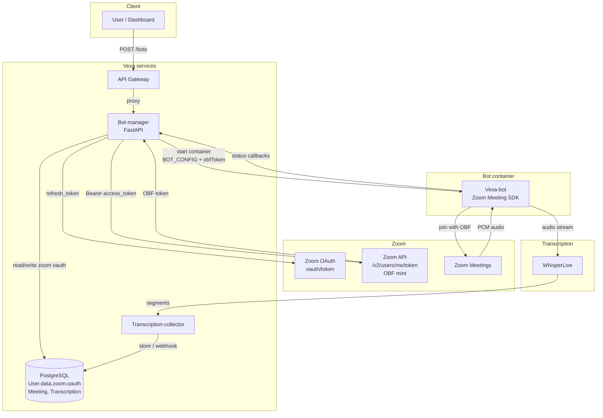

# Vexa Meeting Bot — Zoom architecture

This document defines the architecture diagram for Zoom Technical Design submission. Export the Mermaid diagram below to PNG/PDF (e.g. via [Mermaid Live](https://mermaid.live) or `mmdc`) and upload to Zoom.

## High-level flow

1. **User** starts a bot via API/Dashboard with meeting URL.
2. **Bot-manager** loads user’s Zoom OAuth from PostgreSQL; refreshes access token via Zoom OAuth; mints OBF token via Zoom API; starts **Vexa-bot** container with OBF token.
3. **Vexa-bot** (Zoom Meeting SDK) joins the Zoom meeting with the OBF token, captures PCM audio, streams to **WhisperLive** for transcription.
4. Transcripts are delivered via **transcription-collector** / API and optionally stored in PostgreSQL.

## Diagram (Mermaid)

## Export instructions

- **Mermaid Live:** Paste the contents of the `flowchart TB` block (from `flowchart TB` through the last `)` into [https://mermaid.live](https://mermaid.live), then export as PNG or PDF.
- **CLI:** If you have `@mermaid-js/mermaid-cli` installed: `mmdc -i zoom-architecture-diagram.md -o zoom-architecture-diagram.png` (or use the Mermaid code in a `.mmd` file).

## Pre-generated PNG

A PNG version is checked in as **`vexa/docs/zoom-architecture-diagram.png`** for direct upload to Zoom (Technical Design → Overview → Architecture Diagram).

## File for Zoom

Upload **one** file in PDF, PNG, JPG, JPEG, DOCX, or MOV. The PNG above (or a PDF exported from Mermaid Live) satisfies the requirement: “Provide an architectural diagram with additional flow diagrams where possible. This includes any service that interacts with Zoom, such as databases, servers and third-party applications that are required for your application to function.”
